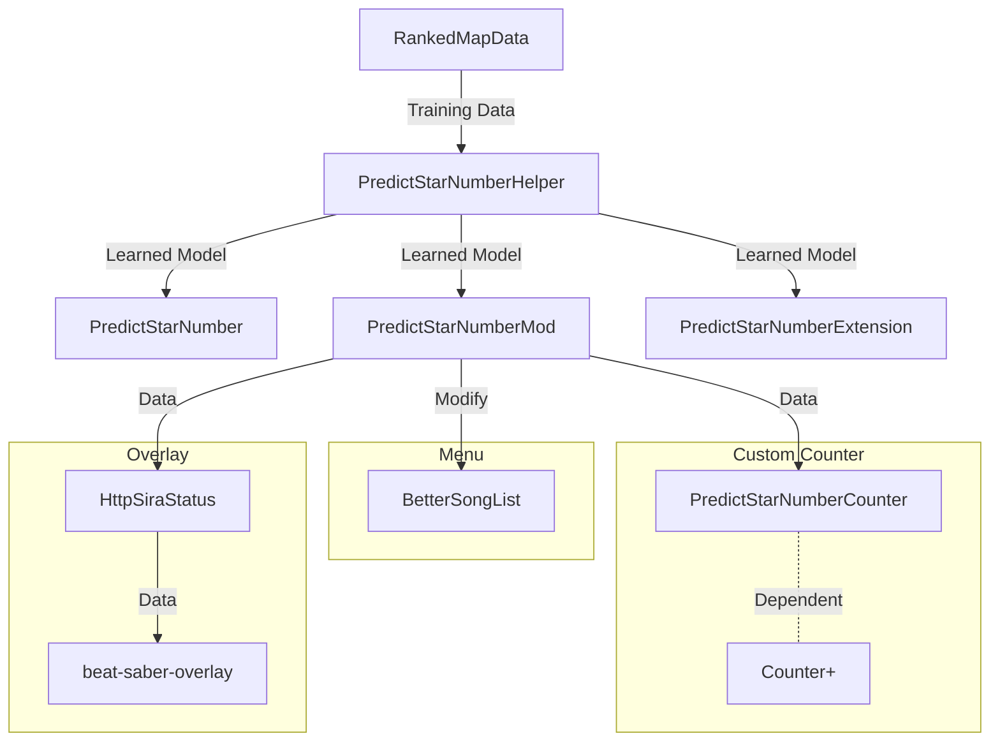

# PredictStarNumberMod

## これは何
[BetterSongListに星予測機能をいれたMod](https://github.com/rakkyo150/BetterSongList-PredictStarNumber)の後継Modです。 
今後はこちらを更新していきます。 
Standard以外のLawlessなどの譜面にも対応できるようになりました。 

星予測値に基づいた自己ベストのPPを譜面選択画面に表示する機能を追加しました。 

~~オリジナルのBetterSongListとともに使用してください。 ~~
v2.0.0以上又はBeat Saberの本体バージョン1.29.1のためにバックポートしたv1.2.2以上では、BetterSongListが無くても動くようになりました。 
もっとも、BetterSongListとともに使用するのを推奨します。 
ついでに一応SongDetailsCacheにも依存しないようにしました。 
BetterSongListを使用しない場合は以下のように表示されます。 

星予測値に基づく自己ベストのPPとプレイ中のスコアに基づくPPをCustom Counter(PredictStarNumberCounter)に表示する機能を追加しました。 

星予測値とそれに基づく自己ベストのPPとプレイ中のスコアに基づくPPをオーバーレイに表示する機能を追加しました。 

## 使い方
PredictStarNumberModの設定は、カスタムカウンターとオーバーレイにも影響するので、もし変更する場合は注意してください。 
カスタムカウンター(PredictStarNumberCounter)の設定は、Counters+の設定画面から行ってください。 
オーバーレイに関しては、[こちら](PredictStarNumberMod\Overlay\README_Overlay.md)を参照してください。 
併せて、[beat-saber-overlayのREADME](https://github.com/rynan4818/beat-saber-overlay)を参照してください。 

## 依存Mod
カスタムカウンター(PredictStarNumberCounter)は[Counter+](https://github.com/NuggoDEV/CountersPlus)に依存しています。 
オーバーレイは[HttpSiraStatus](https://github.com/denpadokei/HttpSiraStatus)に依存しています。 
また、[BetterSongList](https://github.com/kinsi55/BeatSaber_BetterSongList)の使用を推奨します。 
いずれのModも(特にBetterSongListは)、インストール可能ならば、[ModAssistant](https://github.com/bsmg/ModAssistant)もしくは[BSManager](https://github.com/Zagrios/bs-manager)経由のインストールを推奨します。

## 関連リンク
Training Data : https://github.com/rakkyo150/RankedMapData  
Model : https://github.com/rakkyo150/PredictStarNumberHelper  
Mod : https://github.com/rakkyo150/PredictStarNumberMod  
Chrome Extension : https://github.com/rakkyo150/PredictStarNumberExtension  

Counters+ : https://github.com/NuggoDEV/CountersPlus or https://github.com/rakkyo150/CounterPlus-Improved 
BetterSongList : https://github.com/kinsi55/BeatSaber_BetterSongList 
HttpSiraStatus : https://github.com/denpadokei/HttpSiraStatus 
beat-saber-overlay : https://github.com/rynan4818/beat-saber-overlay 

